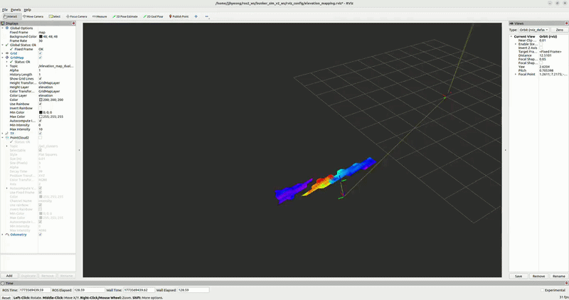

# Tilted 2D LiDAR-Based Elevation Mapping for Mobile Robots

ROS2 (Humble) implementation of a real-time elevation mapping system using a single tilted 2D LiDAR sensor on an outdoor mobile robot.

---

## Key Features

- **GPS Waypoint Autonomous Navigation** — Based on the Navigation2 stack
- **Real-Time Elevation Map Generation** — 3D point cloud reconstruction using a tilted RPLIDAR
- **Dual UKF Sensor Fusion** — Wheel odometry + GPS/IMU integration

---

## Demo



---

## Repository Structure

```
ros2_ws/bunker_sim_v2_ws/src/
├── bunker_description/       # Robot URDF/Xacro model
├── bunker_sim_bringup/       # TF publisher, GPS filter (C++)
├── bunker_nav2/              # GPS waypoint follower (Python + YAML)
└── bunker_util/              # Elevation mapping core (C++17)  ← Main
    ├── src/
    │   ├── scan_processor.cpp            # Main node: LiDAR + odometry → elevation map
    │   ├── elevation_map_max.cpp         # Max-height algorithm
    │   ├── elevation_map_kalman.cpp      # 1D Kalman filter algorithm
    │   ├── elevation_map_dual_layer.cpp  # DualLayer algorithm (primary)
    │   └── map_sub.cpp                   # Map subscriber / republisher / CSV saver
    ├── include/bunker_util/
    │   ├── elevation_types.hpp
    │   ├── elevation_map_max.hpp
    │   ├── elevation_map_kalman.hpp
    │   └── elevation_map_dual_layer.hpp
    ├── launch/
    │   └── system_start.launch.py
    └── config/
        └── scan_processor_params.yaml
```

---

## Elevation Mapping Algorithms

| Algorithm | Topic | Description |
|-----------|-------|-------------|
| `max` | `/elevation_map_max` | Accumulates the maximum height per cell |
| `kalman` | `/elevation_map_kalman` | Applies 1D Kalman filter to all points without label separation |
| `dual_layer` | `/elevation_map_dual_layer` | Separates ground (low) / obstacle (high) layers and fuses them **(primary)** |

### DualLayer Algorithm Overview

```
LiDAR points → Label classification (ground / upper / vertical)
    ↓
low layer  : ground points   → Kalman update (bidirectional, ground tracking)
high layer : upper + vertical → monotonic update (obstacle persistence)
    ↓
Hit-count-based fusion → final elevation decision
```

---

## TF Frame Structure

```
map → map_rot → base_link → base_lidar
                           → gps
                           → imu
```

- `map`: Global coordinate frame based on GPS
- `map_elev`: Rotated frame dedicated to elevation mapping (8.9° correction)

---

## Dependencies

| Package | Purpose |
|---------|---------|
| `rclcpp`, `sensor_msgs`, `nav_msgs` | ROS2 core |
| `grid_map_ros` | Elevation grid map library |
| `robot_localization` | Dual UKF sensor fusion |
| `nav2_*` | Navigation2 stack |
| `tf2_ros`, `tf2_geometry_msgs` | Coordinate transforms |
| `message_filters` | ApproximateTime synchronization |
| `OpenCV` | Image processing |

---

## Dataset & RViz Configuration

### RViz Config

```
rviz_config/
└── elevation_mapping.rviz   # Default visualization config for elevation maps
```

- GridMap layers: `/elevation_map_dual_layer`, `/elevation_map_kalman`, `/elevation_map_max`
- LaserScan: `/tilt_lidar_scan`
- Odometry: `/odometry/global`
- TF tree visualization included

### ROS Bag Data

```
rosbag/
└── 5/   # Outdoor driving experiment data
    ├── 5_0.db3
    └── metadata.yaml
```

> rosbag files are large and excluded from version control via `.gitignore`.
> Place the provided dataset in the `rosbag/` directory before running.

**Recorded Topics:**

| Topic | Type |
|-------|------|
| `/tilt_lidar_scan` | `sensor_msgs/LaserScan` |
| `/odometry/global` | `nav_msgs/Odometry` |
| `/wheel/odometry` | `nav_msgs/Odometry` |
| `/imu/data` | `sensor_msgs/Imu` |
| `/fix` | `sensor_msgs/NavSatFix` |

---

## Installation

Assumes `ros-humble-desktop` is already installed. Install additional dependencies:

```bash
# grid_map
sudo apt install ros-humble-grid-map

# robot_localization (Dual UKF sensor fusion)
sudo apt install ros-humble-robot-localization

# Navigation2
sudo apt install ros-humble-navigation2 ros-humble-nav2-bringup

# TF and message utilities
sudo apt install \
    ros-humble-tf2-tools \
    ros-humble-tf2-geometry-msgs \
    ros-humble-message-filters
```

---

## Build

```bash
cd ~/ros2_ws/bunker_sim_v2_ws
colcon build --symlink-install
source install/setup.bash
```

---

## Usage

### Launch Full System

```bash
ros2 launch bunker_util system_start.launch.py
```

### Algorithm Selection

```bash
# DualLayer only
ros2 launch bunker_util system_start.launch.py \
    enable_map_max:=false enable_map_kalman:=false enable_map_dual_layer:=true

# Kalman only
ros2 launch bunker_util system_start.launch.py \
    enable_map_max:=false enable_map_kalman:=true enable_map_dual_layer:=false
```

### Test with ROS Bag

```bash
# Automated setup (tmux 3-pane split + auto source)
./run_mapping.sh [bag_dir]

# Manual
# Terminal 1: Mapping system
source install/setup.bash
ros2 launch bunker_util system_start.launch.py

# Terminal 2: Play bag
ros2 bag play rosbag/5/ --clock

# Terminal 3: RViz
rviz2 -d rviz_config/elevation_mapping.rviz
```

---

## Parameters (`scan_processor_params.yaml`)

| Parameter | Default | Description |
|-----------|---------|-------------|
| `sync_limit_time` | `0.05` | Max time difference for LiDAR-odometry sync (sec) |
| `map_resolution` | `0.1` | Map resolution (m/cell) |
| `map_width` / `map_height` | `50.0` | Map size (m) |
| `max_distance` | `2.0` | Maximum valid LiDAR range (m) |
| `odom_z_offset` | `-156.714` | GPS altitude offset (field-calibrated value) |
| `enable_map_max` | `true` | Enable Max map |
| `enable_map_kalman` | `true` | Enable Kalman map |
| `enable_map_dual_layer` | `true` | Enable DualLayer map |
| `odom_stable_threshold` | `0.5` | EKF stabilization threshold (m/frame) |
| `odom_stable_min_count` | `10` | Consecutive stable frames required |
| `enable_debug_csv` | `false` | Enable debug CSV logging |

---

## Field Calibration Constants — Do Not Modify Without On-Site Calibration

| Constant | Value | File |
|----------|-------|------|
| GPS altitude offset | `-157.195 + 0.481` | `map_cal.cpp` |
| Map yaw rotation | `8.9°` | `map_cal.cpp` |
| LiDAR mounting angle | `pitch=-30°, yaw=180°` | `bunker_start.launch.py` |
| LiDAR position offset | `x=0.285m, z=0.068m` | `bunker_start.launch.py` |
| GPS position offset | `x=0.157m, z=0.155m` | `bunker_start.launch.py` |

---

## Hardware

| Sensor | Model |
|--------|-------|
| LiDAR | SLAMTEC RPLIDAR S-series |
| GPS | u-blox ZED-F9P (RTK) |
| IMU/INS | VectorNav |
| Robot Platform | AgileX Bunker |
